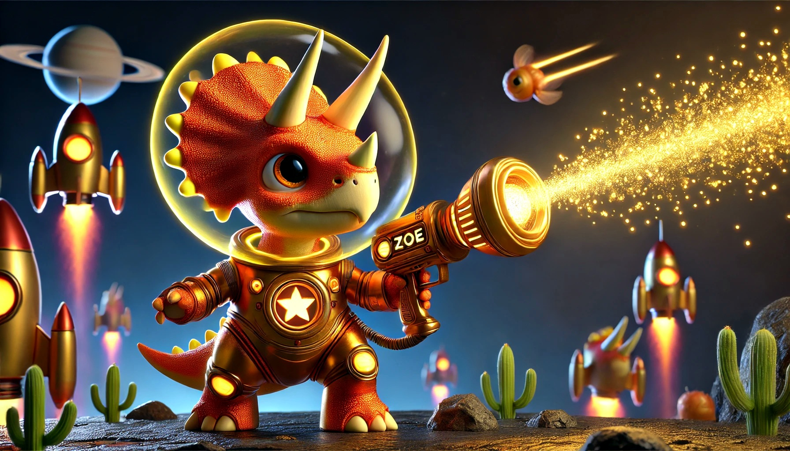

# Zoe - The Intergalactic Ad Server

## Welcome to Zoe's Cosmic Adventures! 

Zoe is a lightning-fast, intergalactic ad server written in Zig, powered by Zap, and guided by a space-faring dino. Join us on a journey through the advertising cosmos!




## Table of Contents
- [Getting Started](#getting-started)
- [Server API](#server-api)
- [Contributing](#contributing)
- [License](#license)

## Getting Started

Strap on your space helmet and follow these steps to launch Zoe into orbit:

1. Ensure you have Zig installed (version 0.14.0 or later recommended)
2. Clone this repository:

```bash
git clone https://github.com/davidgeorgewilliams/Zoe.git
cd Zoe
```
3. Build the project:

```bash
zig build 
```
4. Launch Zoe into the advertising stratosphere:
```bash
zig build run
```
5. Open your space-age browser and navigate to `http://localhost:3000`

Congratulations, cadet! You're now ready to explore the far reaches of the advertising universe with Zoe!

## Server API

Zoe's current galactic coordinates (endpoints):

- `/` - Home Base: Welcome message and navigation links
- `/ads` - Ad Nebula: Returns a JSON array of cosmic advertisements
- `/adventure` - Space Odyssey: Embark on a text-based space adventure with Zoe

More exotic destinations coming soon in future star charts (updates)!

## Contributing

Zoe is Free and Open Source Software. We welcome bug reports and patches from everyone across the galaxy. However, keep in mind that Zig governance is BDFN (Benevolent Dictator For Now) which means that David George Williams has final say on the design and implementation of everything.

To contribute:
1. Fork the repository
2. Create your feature branch (`git checkout -b feature/AmazingFeature`)
3. Commit your changes (`git commit -m 'Add some AmazingFeature'`)
4. Push to the branch (`git push origin feature/AmazingFeature`)
5. Open a Pull Request

Remember, in space, no one can hear you code... but they can read your commit messages!

## License

Zoe is released under the MIT License. See the [LICENSE](LICENSE) file for details.

---

Powered by Zig, fueled by stardust, and piloted by Zoe the Triceratops Space Adventurer. 
Ad astra per astra! 